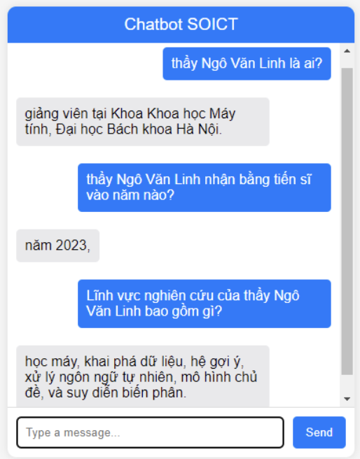

# Question Answering Chatbot

## 📑 Table of Contents
- [📌 Overview](#-overview)
- [⚙️ Installation](#️-installation)
- [📂 Data Preparation](#-data-preparation)
- [🚀 Usage](#-usage)
- [🤖 Model](#-model)
- [📊 Evaluation](#-evaluation)
- [💻 Demo](#-demo)
- [📦 Repository](#-repository)
- [👤 Credits](#-credits)

## Overview
This project implements a question-answering chatbot using the BARTPho model, fine-tuned specifically on Vietnamese language data. The chatbot is designed for answering questions based on provided textual contexts about teachers in the School of Information and Technology (HUST), following the format of the SQuAD dataset.

## Installation

Install required packages:

```bash
pip install datasets evaluate transformers[torch]
```

## Data Preparation
The dataset follows the SQuAD format, including contexts, questions, and corresponding answers. Prepare your data in JSON format (e.g., `question.json`), structured similarly to the SQuAD format:

```json
{
  "version": "1.1",
  "data": [
    {
      "title": "Document title",
      "paragraphs": [
        {
          "context": "Your context here.",
          "qas": [
            {
              "id": "unique-id",
              "question": "Your question here?",
              "answers": [{"text": "Answer", "answer_start": 0}],
              "is_impossible": false
            }
          ]
        }
      ]
    }
  ]
}
```

## Usage

Load and preprocess the dataset:

```python
from datasets import load_dataset
from transformers import PreTrainedTokenizerFast

tokenizer = PreTrainedTokenizerFast.from_pretrained("vinai/bartpho-syllable")

dataset = load_dataset('path/to/your_dataset.py')

# Tokenize input data
inputs = tokenizer(question, context,
                   max_length=100,
                   truncation="only_second",
                   stride=50,
                   return_overflowing_tokens=True,
                   return_offsets_mapping=True)
```

Train your model with processed data and evaluate its performance.

## Model
- **Model**: BARTPho
- **Tokenizer**: vinai/bartpho-syllable

## Evaluation

The preprocessing script maps answer positions and prepares the dataset for evaluation. Use metrics such as accuracy, F1-score, and Exact Match (EM) for evaluation.

## Demo:


## Repository
For complete details and source code, visit the [GitHub Repository](https://github.com/thaisvsthinhs/Question-Answering-Chatbot).

## Credits
- **Author**: [thaisvsthinhs](https://github.com/thaisvsthinhs)

---

For detailed instructions and code, please refer to the provided Jupyter notebook in the repository.

